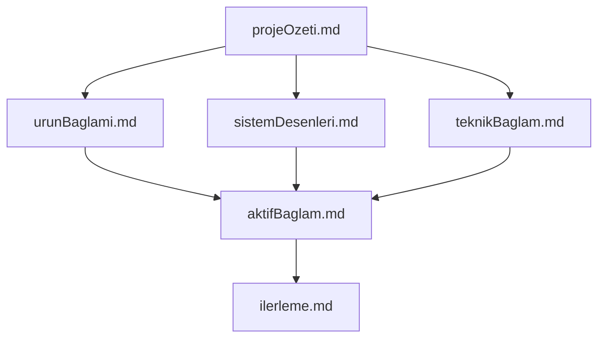
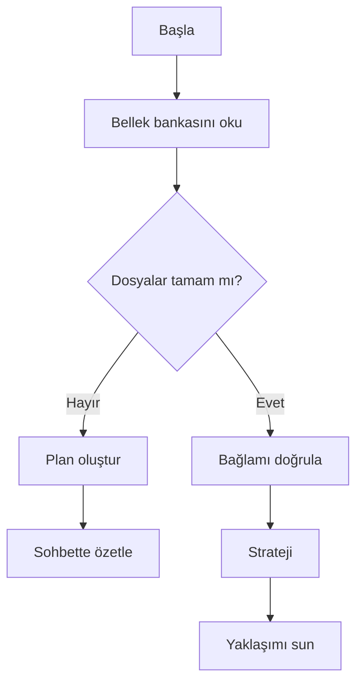
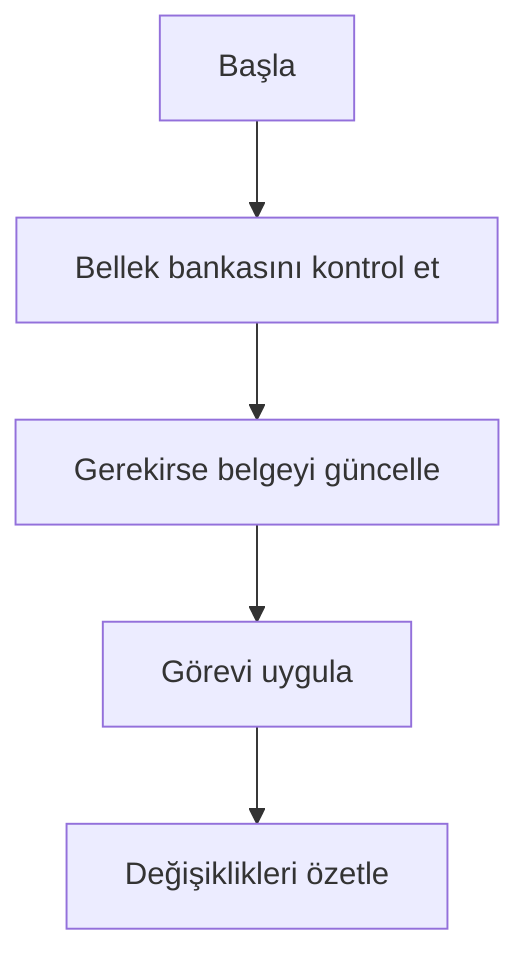

# Ajan Bellek Bankası Rehberi

Bu dosya, oturumlar arasında sıfırlanan yapay zekâ ajanlarına (Cursor, Cline vb.) proje bağlamını **kalıcı tek kaynak** olarak `memory-bank/` klasöründeki Markdown belgeleriyle aktarmak için kullanılır. Her önemli görevde bu belgeler okunmalıdır.

## Bellek Bankası Konumu

Tüm güncel proje özeti, mimari ve ilerleme bilgisi şurada tutulur:

`memory-bank/`

| Dosya | İçerik |
|--------|--------|
| `projeOzeti.md` | Kapsam, araç envanteri, çıktı |
| `urunBaglami.md` | İş değeri, kullanıcı, hedef deneyim |
| `aktifBaglam.md` | Son odak, son değişiklikler, tercihler |
| `sistemDesenleri.md` | Mimari, routing, desenler |
| `teknikBaglam.md` | Stack, klasör yapısı, çalıştırma |
| `ilerleme.md` | Tamamlananlar, yapılacaklar, bilinen konular |

## Bellek Bankası Yapısı (hiyerarşi)

### Temel Dosyalar (gerekli)

1. **`projeOzeti.md`** — Proje kapsamı, araç listesi, temel gereksinimler.
2. **`urunBaglami.md`** — Neden var, çözdüğü problemler, UX hedefleri.
3. **`aktifBaglam.md`** — Güncel odak, son yapılanlar, sonraki adımlar, tercihler.
4. **`sistemDesenleri.md`** — Mimari, auto-discovery, auth, modül ilişkileri.
5. **`teknikBaglam.md`** — Teknolojiler, bağımlılıklar, kurulum, kısıtlar.
6. **`ilerleme.md`** — Durum, yapılacaklar, bilinen riskler.

### Ek bağlam

`memory-bank/` altında gerektiğinde ek dosyalar (API notları, entegrasyon, test) tutulabilir.

## Temel İş Akışları

### Plan modu

### Eylem modu

## Dokümantasyon güncellemeleri

Bellek bankası şu durumlarda güncellenir:

1. Yeni kalıcı desen veya modül eklendiğinde.
2. Önemli mimari / ürün değişikliğinden sonra.
3. Kullanıcı özellikle talep ettiğinde (tüm `memory-bank/*.md` gözden geçirilmeli).
4. Bağlam belirsizleştiğinde.

**Not:** Güncelleme tetiklendiğinde özellikle `aktifBaglam.md` ve `ilerleme.md` güncel tutulmalıdır.
