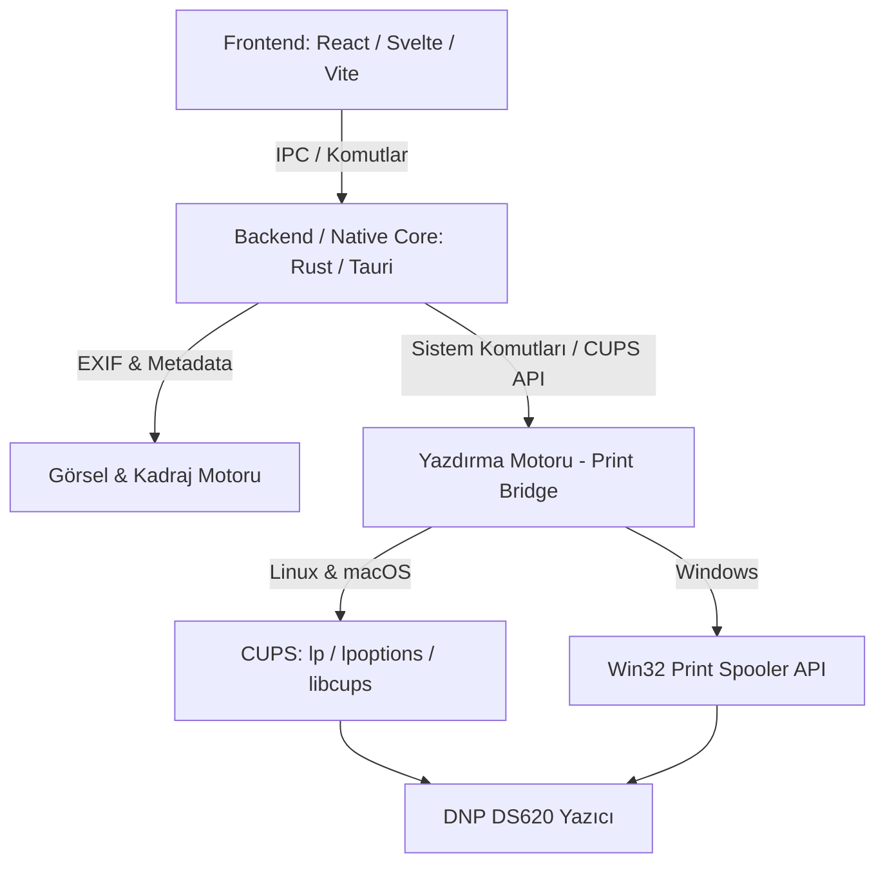

# Sistem Desenleri ve Mimarisi

## Genel Mimari
Uygulama, performans ve hafiflik için yerel işletim sistemi yetenekleriyle modern web arayüzünü birleştiren masaüstü mimarisi (Tauri tabanlı) üzerine kurgulanır:

## Temel Sistem Bileşenleri

### 1. Görsel & Kadrajlama Motoru (Image Engine)
- **Hızlı Önizleme (Thumbnail Caching):** RAW/JPEG dosyalarından gömülü EXIF küçük resimlerini anında okur.
- **Yön Algılama (Orientation Detection):** EXIF `Orientation` etiketini ve piksel en/boy oranını analiz ederek fotoğrafı otomatik dik veya yatay konumlandırır. Manuel `90°` çevirme desteği sağlar.
- **6x8 Piksel-Kusursuz (Pixel-Perfect) Hazırlık:**
  - 6x8 inç @ 300 DPI = **1800 x 2400 piksel** (Dikey) / **2400 x 1800 piksel** (Yatay).
  - Kullanıcı önizlemede kadrajı kaydırdığında (offset x/y), yazıcıya gönderilmeden önce bu tam piksel ebatında kesilir. Sürücüye tam ebat verildiği için kağıt üzerinde beklenmeyen kırpma veya beyaz şerit oluşmaz.

### 2. Çoklu Platform Yazdırma Motoru (Print Bridge)
- **Linux & macOS Katmanı:** CUPS arayüzünü kullanır. `lpstat -p -d` ile yazıcıları listeler, `lpoptions -p <yazici> -l` ile medya boyutlarını ve parlak/mat seçeneklerini çeker, `lp -d <yazici> -o media=w432h576 <dosya>` ile doğrudan kuyruğa gönderir.
- **Windows Katmanı:** Windows Spooler API veya yerel CLI yazdırma aracılığıyla DNP DS620 sürücüsüne yönlendirir.

### 3. Kullanıcı Arayüzü Düzeni (Single-Window Workflow)
- **Üst Bar:** Klasör seçimi, dosya sayısı, filtreler (Tümü / Basılanlar).
- **Merkez Alan:** Büyük fotoğraf gösterici + şeffaf 6x8 kırpma çerçevesi.
- **Alt Bar:** Hızlı kaydırılabilir küçük resim şeridi (Filmstrip) ve baskı durumu rozetleri.
- **Sağ Panel:** Yazıcı durum kartı (🟢 Bağlı), Kağıt: 6x8, Yüzey: Parlak/Mat, Kopya sayısı, Dev "Yazdır" butonu ve kısayol rehberi.
